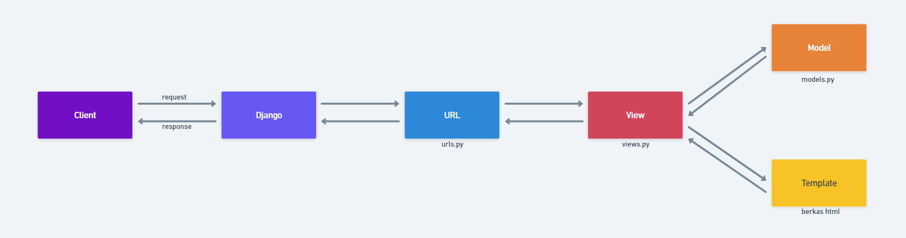
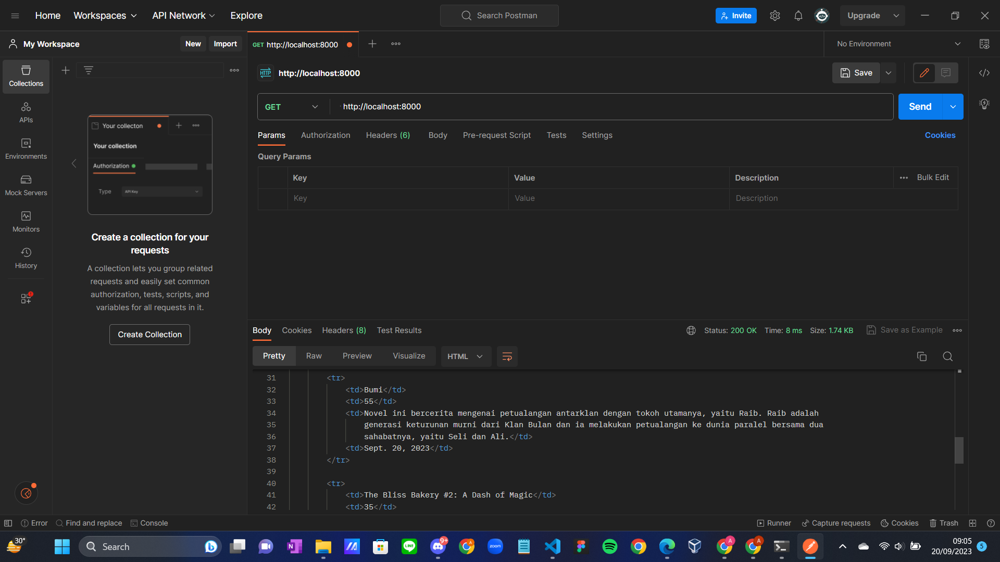
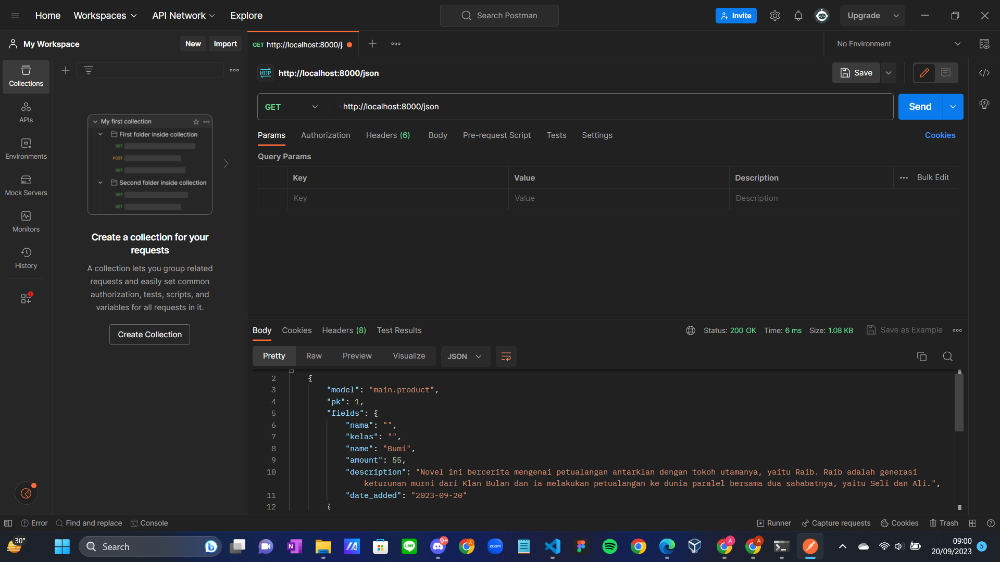
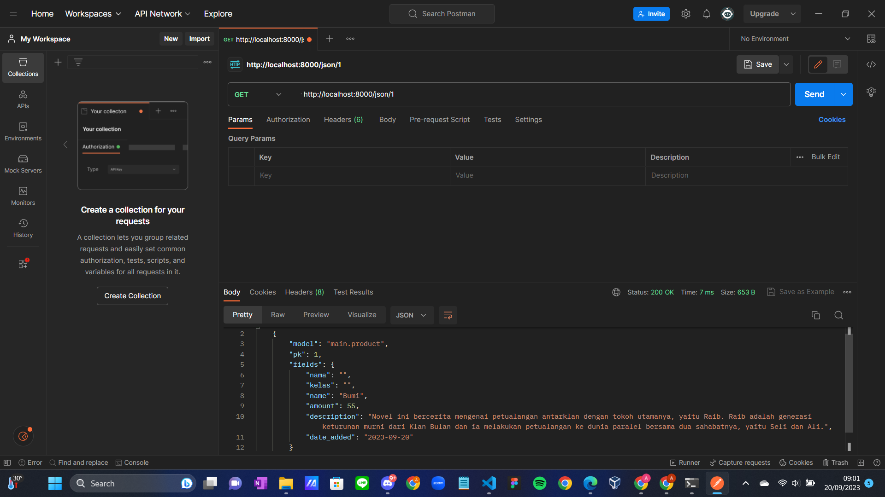
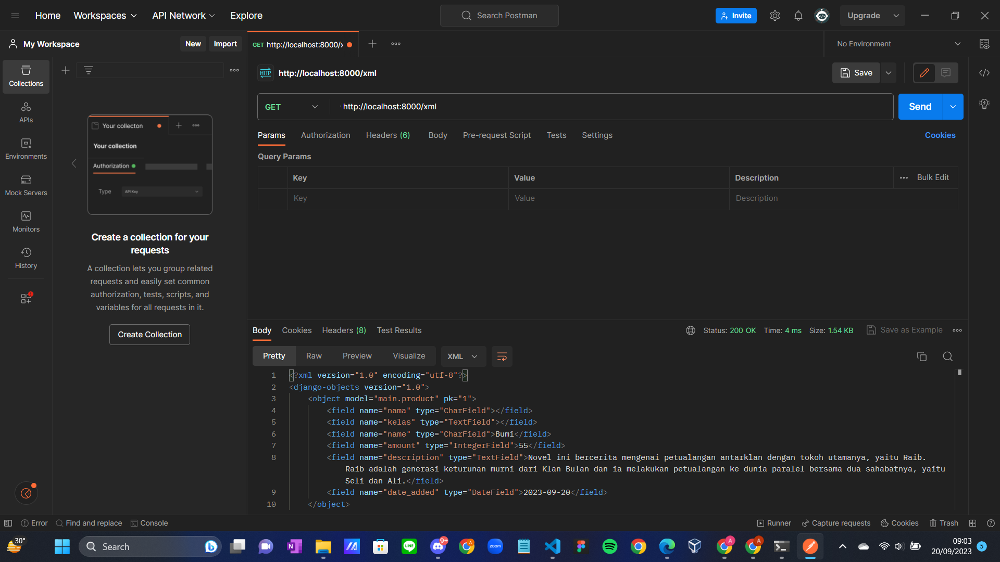
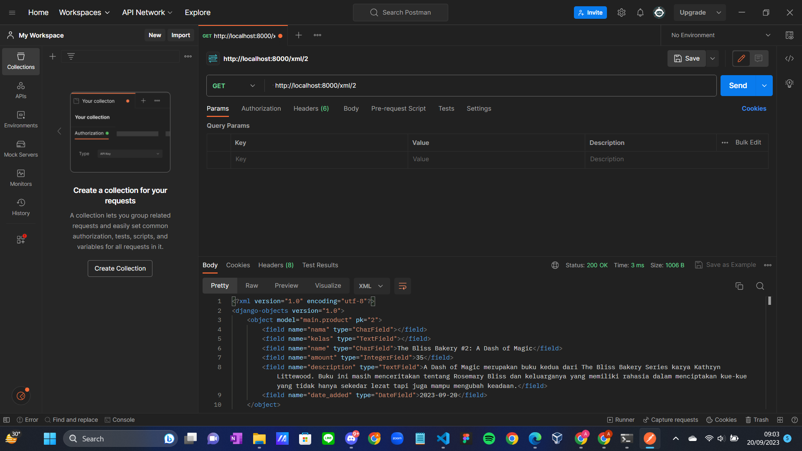
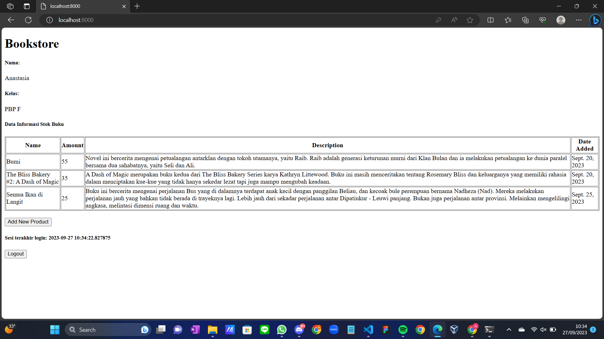
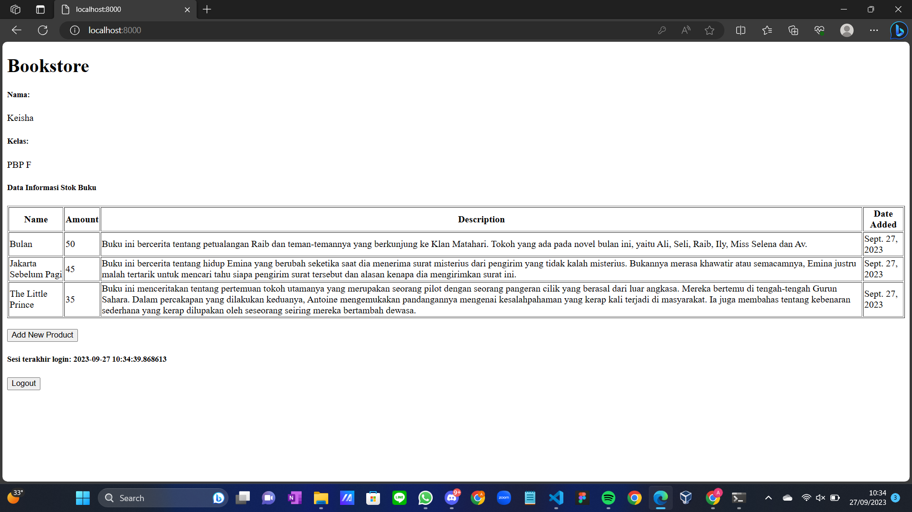

Nama: Anastasia Keisha Bella Arianne Pepe

NPM: 2206082272

Kelas: PBP F

=== TUGAS 2 ===

Link adaptable: https://bookstore.adaptable.app/main/

1. Jelaskan bagaimana cara kamu mengimplementasikan checklist di atas secara step-by-step (bukan hanya sekadar mengikuti tutorial).

a. Membuat sebuah proyek Django baru.
- Membuat direktori baru (toko_buku) dan masuk ke dalamnya
- Membuka terminal dan membuat virtual menjalankan perintah "python -m venv env"
- Mengaktifkan virtual environment dengan mennjalankan perintah "env\Scripts\activate.bat". Virtual environment akan aktif yang ditandai dengan (env) di baris input terminal
- Di dalam direktori toko_buku, dibuat berkas requirements.txt dan menambahkan beberapa dependecies
- Pasang dependencies dengan menjalankan perintah "pip install -r requirements.txt"
- Membuat proyek Django dengan nama toko_buku dengan perintah "django-admin startproject shopping_list ."
- Untuk konfigurasi proyek dan menjalankan server, ditambahkan "*" pada ALLOWED_HOST di settings.py untuk keperluan deployment dan mengizinkan akses dari semua host
- Menjalankan server Django dengan perintah "python manage.py runserver"
- Membuka http://localhost:8000 pada peramban web dan terlihat animasi roket, maka aplikasi Django sudah berhasil dibuat
- Menghentikan server dengan CTRL + C
- Menonaktifkan virtual environment dengan perintah "deactivate"
- Membuat repositori GitHub baru (toko-buku) dengan visibilitas public
- Menginisiasi direktori toko_buku sebagai repositori Git
- Menambahkan dan mengisi berkas .gitignore untuk menentukan berkas-berkas dan direktori-direktori yang harus diabaikan oleh Git
- Melakukan add, commit, push dari direktori lokal

b. Membuat aplikasi dengan nama main pada proyek tersebut.
- Membuka direktori proyek toko_buku yang sebelumnya sudah dibuat
- Membuka terminal dengan direktori kerja saat ini adalah direktori utama toko_buku
- Mengaktifkan virtual environment dengan menjalankan perintah "env\Scripts\activate.bat"
- Membuat aplikasi baru bernama "main" dengan menjalankan perintah "python manage.py startapp main"
- Mendaftarkan aplikasi main ke dalam proyek dengan membuka berkas settings.py di dalam direktori proyek toko_buku dan menambahkan 'main' ke variabel "INSTALLED_APPS" untuk mendaftarkan aplikasi main ke dalam proyek toko_buku 

c. Melakukan routing pada proyek agar dapat menjalankan aplikasi main.
= Membuat model pada aplikasi main dengan nama Item dan memiliki atribut wajib sebagai berikut.
name sebagai nama item dengan tipe CharField.
amount sebagai jumlah item dengan tipe IntegerField.
description sebagai deskripsi item dengan tipe TextField.
- Membuat direktori baru bernama templates dalam direktori aplikasi main
- Membuat dan mengisi berkas main.html sesuai data yang diinginkan dan diperlukan
- Memeriksa tampilan dasar html dengan membuka main.html di peramban web
- Mengubah berkas models.py dalam aplikasi main untuk mendefinisikan model baru dengan atribut atau field yang diinginkan dan diperlukan
- Membuat migrasi model dengan menjalankan perintah "python manage.py makemigrations" 
- Menjalankan perintah "python manage.py migrate" untuk menerapkan migrasi ke dalam basis data lokal

d. Membuat sebuah fungsi pada views.py untuk dikembalikan ke dalam sebuah template HTML yang menampilkan nama aplikasi serta nama dan kelas kamu.
- Membuka berkas views.py di dalam berkas aplikasi main
- Menambahkan baris-baris impor "from django.shortcuts import render" di bagian paling atas berkas untuk mengimpor fungsi render dari modul django.shortcuts yang akan digunakan untuk me-render tampilan html dengan menggunakan data yang diberikan. 
- Menambahkan fungsi show_main(request) di bawah impor dan mengisi dictionary context yang berisi data yang akan dikirimkan ke tampilan serta me-return render(request, "main.html", context) untuk me-rendder tampilan main.html dengan menggunakan fungsi render
- Mengubah template main.html agar dapat menampilkan data yang telah diambil dari model dengan mengubah variabel yang sebelumnya dibuat secara statis menjadi kode Django yang sesuai untuk menampilkan data

e. Membuat sebuah routing pada urls.py aplikasi main untuk memetakan fungsi yang telah dibuat pada views.py.
- Membuat berkas urls.py di dalam direktori main
- Mengisi urls.py dengan kode yang sesuai untuk mengartur rute url yang terkait dengan aplikasi main
- Impor path dari django.urls untuk mendefinisikan pola url
- Menggunakan fungsi show_main dari modul main.views sebagai tampilan yang akan ditampilkan ketika URL terkait diakses
- Nama pada app_name untuk memberikan nama unik pada pola url dalam aplikasi
- Selanjutnya, buka berkas urls.py di dalam direktori proyek toko_buku, bukan yang ada dalam direktori aplikasi main
- Mengimpor fungsi include dari django.urls
- Menambahkan rute url untuk mengarahkan ke tampilan main di dalam variabel urlpatterns
- Menjalankan pryek Django dengan perintah "python manage.py runserver"
- Membuka http://localhost:8000/main/ di peramban web untuk melihan halaman yang sudah dibuat

f. Melakukan deployment ke Adaptable terhadap aplikasi yang sudah dibuat sehingga nantinya dapat diakses oleh teman-temanmu melalui Internet.
- Login ke Adaptable.io menggunakan akun GitHub yang digunnakan untuk membuat proyek toko_buku
- Menekan tombol "New App"
- Memilih "Connect an Existing Repository"
- Menghubungkan Adaptable.io dengan GitHub dan memilih "All Repositories" pada proses instalasi
- Memilih repositori proyek toko-buku sebagai basis aplikasi yang akan di deploy
- Memilih branch main untuk dijadikan sebagai deployment branch
- Memilih "Python App Template" sebagai template deployment
- Memilih "PostgreSQL" sebagai tipe basis data yang akan digunakan
- Menyesuaikan versi python dengan spesifikasi aplikasi
- Pada bagian "Start Command" dimasukkan perintah "python manage.py migrate && gunicorn toko_buku.wsgi"
- Memasukkan nama aplikasi yang akan menjadi nama domain situs web aplikasi
- Centang bagian "HTTP Listener on PORT" dan klik  "Deploy App" untuk memulai proses deployment aplikasi

g. Membuat sebuah README.md yang berisi tautan menuju aplikasi Adaptable yang sudah di-deploy
- Menambahkan READM.md di direktori utama toko_buku
- Melakukan add, commit, push

2. Buatlah bagan yang berisi request client ke web aplikasi berbasis Django beserta responnya dan jelaskan pada bagan tersebut kaitan antara urls.py, views.py, models.py, dan berkas html.

Penjelasan:
- User membuat request ke web aplikasi berbasi Django
- Request tersebut diteruskan ke Django
- Django mengidentifikasi path url (urls.py mengatur rute url terkait)
- View menggunakan model untuk memproses request dan meneruskannya ke template (views.py mengatur logika bisnis aplikasi dan menangani request yang diterima melalui url dengan mengambil data dari model, memproses data itu, kemudian memberikan response)
- Model digunakan untuk mengakses dan menyimpan data ke dalam basis data (models.py)
- Template akan menghasilkan response yang sesuai dengan menampilkan data yang diterima dari database, seperti berkas html 
- Berkas html diteruskan ke web client

3. Jelaskan mengapa kita menggunakan virtual environment? Apakah kita tetap dapat membuat aplikasi web berbasis Django tanpa menggunakan virtual environment?
- Virtual environment digunakan karena proyek dapat membutuhkan dependencies yang berbeda-beda setiap proyeknya. Oleh karena itu, dibutuhkan virtual environment untuk menjalankannya tanpa merubah konfigurasi sistem operasi yang kita pakai agar menghindari masalah/crash.
- Kita masih dapat membuat aplikasi web berbasis Django tanpa menggunakan virtual environment, tetapi dapat memungkinkan terjadinya masalah konlfik versi dan kesulitan dalam mengelola dependencies.

4. Jelaskan apakah itu MVC, MVT, MVVM dan perbedaan dari ketiganya.
a. MVC (Model-View-Controller) -> Sebuah pola desain arsitektur yang digunakan dalam pengembangan web  dengan cara memisahkan kode menjadi tiga bagian, yaitu Model, View, dan Controller.
- Model: Menyimpan data dan logika bisnis 
- View: Menampilkan data kepada pengguna dalam bentuk GUI (Graphical User Interface)
- Controller: Menghubungkan dan mengatur model serta view
b. MVT (Model-View-Template) -> Sebuah konsep arsitektur yang digunakan dalam pengembangan web untuk memisahkan komponen-komponen utama dari sebuah aplikasi. Konsep ini memungkinkan pengembang web untuk mengorganisasi dan mengelola kode dengan lebih terstruktur.
- Model: Menyimpan data dan logika aplikasi.
- View: Menampilkan data dari model dan menghubungkannya dengan template.
- Template: Menentukan tampilan antarmuka pengguna.
c. MVVM (Model-View-ViewModel) -> Sebuah arsitektur pembuatan aplikasi berbasi GUI yang berfokus pada peisahan antara lofika bisnis dan tampilan aplikasi.
- Model: Menyimpan data dan logika bisnis 
- View: Menampilkan data ke pengguna, tetapi tidak memiliki logika bisnis
- ViewModel: Perantara antara Model dan View. Berinteraksi dengan model dimana data yang ada akan diteruskan ke View

Perbedaan:
- MVC -> umum digunakan dalam pengembangan web tradisional, tampilannya dikontrol oleh View
- MVT -> khusus digunakan dalam Django, penggunaan template yang berperan dalam menampilkan data
- MVVM -> umum digunakan dalam pengembangan aplikasi berbasis dekstop dan mobile, menggunakan ViewModel sebagai perantara sehingga tampilan antarmuka pengguna lebih dinamis

=== TUGAS 3 ===

1. Apa perbedaan antara form POST dan form GET dalam Django?
GET
- Tidak menampilkan data atau nilai pada URL
- Lebih aman untuk data-data sensitif, seperti password
- Digunakan untuk data yang relatif kecil

POST
- Menampilkan data atau nilai pada URL
- Kurang aman untuk data sensitif
- Digunakan untuk data yang relatif besar

2. Apa perbedaan utama antara XML, JSON, dan HTML dalam konteks pengiriman data?
XML
- Markup languange untuk menyimpan dan nmengirim data
- Menyimpan elemen secara terstruktur 
- Lebih sulit dibaca karena banyaknya tag dan hierarki yang kompleks

JSON
- Syntax JSON lebih mudah dibaca dibandingkan XML
- Memiliki stuktur yang lebih sederhana

HTML
- Berfokus dalam penyajian data untuk mengatur tampilan dari halaman web
- Mudah dibaca

3. Mengapa JSON sering digunakan dalam pertukaran data antara aplikasi web modern?
JSON sering digunakan dalam pertukaran data antara aplikasi web modern karena memiliki syntax yang ringan dan mudah dibaca oleh manusia. Selain itu, JSON mudah diproses oleh mesin dan mudah untuk melakukan parsing.

4. Jelaskan bagaimana cara kamu mengimplementasikan checklist di atas secara step-by-step (bukan hanya sekadar mengikuti tutorial).
a. Membuat input form untuk menambahkan objek model pada app sebelumnya
- Membuka folder toko_buku lalu masuk ke cmd
- Menjalankan virtual environment
- Membuka urls.py yang ada di folder toko_buku lalu ubah path main/ menjadi ''
- Mengimplementasikan skeleton sebagai kerangka views dengan membuat folder templates pada root folder dan membuat berkas base.htm yang berfungsi sebagai template dasar yang dapat digunakan sebagai kerangka umum untuk halaman web lainnya di dalam proyek.
- Membuka settings.py pada subdirektori shopping_list dan menambahkan "'DIRS': [BASE_DIR / 'templates']" pada "TEMPLATES" agar berkas base.html terdeteksi sebagai berkas template.
- Ubah code berkas main.html pada subdirektori templates yang ada pada direktori main dengan menambahkan "" yang berarti kita menggunakan base.html sebagai template utama.
- Membuat berkas baru pada direktori main dengan nama forms.py untuk membuat struktur form yang dapat menerima data produk baru dan mengisi file dengan kode yang sesuai.
- Menambahkan beberapa import yang sesuai pada berkas views.py 
- Membuat fungsi baru bernama create_product pada views.py untuk menerima parameter request dan menuliskan kode yang sesuai untuk menghasilkan formulir yang dapat menambahkan data produk secara otomatis ketika data di-submit dari form.
- Menambahkan "products = Product.objects.all()" pada fungsi show_main dalam berkas views.py untuk mengambil seluruh object Product yang tersimpan pada database.
- Import fungsi create_product dalam urls.py pada folder main
- Menambahkan path url ke dalam urlpatterns pada urls.py di main untuk mengakses fungsi yang sudah di-import.
- Membuat berkas html baru bernama create_product.html pada direktori main/templates dengan kode yang sesuai.
- Menambahkan kode yang sesuai pada main.htm untuk menampilkan data produk dalam bentuk table serta tombol "Add New Product" yang akan redirect ke halaman form.

b. Tambahkan 5 fungsi views untuk melihat objek yang sudah ditambahkan dalam format HTML, XML, JSON, XML by ID, dan JSON by ID
- Membuka views.py pada folder main dan menambahkan import HttpResponse dan Serializer
- Membuat fungsi yang menerima parameter request bernama show_xml dan show_json, lalu mengisinya dengan kode yang sesuai
- Membuat fungsi yang menerima parameter equest dan id bernama show_xml_by_id dan show_json_by_id, lalu mengisinya dengan kode yang sesuai
- Mengimpor fungsi yang sudah dibuat dalam urls.py pada folder main
- Menambahkan path utl ke dalam urlpatterns untuk mengakses fungsi yang sudah diimpor tadi

c. Membuat routing URL untuk masing-masing views yang telah ditambahkan pada poin 2
- Menambahkan 
    path('', show_main, name='show_main'),  -> HTML
    path('create-product', create_product, name='create_product'),
    path('xml/', show_xml, name='show_xml'), -> XML
    path('json/', show_json, name='show_json'),   -> JSON
    path('xml/<int:id>/', show_xml_by_id, name='show_xml_by_id'),  -> XML by ID
    path('json/<int:id>/', show_json_by_id, name='show_json_by_id'),   -> JSON by ID
  ke dalam urlpatterns di urls.py

Screenshot dari hasil akses URL pada Postman
- HTML 

- JSON

- JSON by ID

- XML

- XML by ID

=== TUGAS 4 ===

1. Apa itu Django UserCreationForm, dan jelaskan apa kelebihan dan kekurangannya?
- UserCreationForm adalah impor formulir bawaan yang memudahkan pembuatan formulir pendaftaran pengguna dalam aplikasi web. Dengan formulir ini, pengguna baru dapat mendaftar dengan mudah di situs web Anda tanpa harus menulis kode dari awal.
- Kelebihan: mudah digunakan, data pribadi (seperti password) aman terjaga dalam database, dapat di custom sesuai kebutuhan
- Kekurangan: tampilan defaultnya sederhana, fungsi autentikasinya terbatas, dan tidak memiliki fitur lanjutan selain username dan password

2. Apa perbedaan antara autentikasi dan otorisasi dalam konteks Django, dan mengapa keduanya penting?
- Autentikasi adalah proses memverifikasi identitas pengguna atau siapa yang mengakses (login)
- Otorisasi adalah proses memverifikasi apakah pengguna mempunyai akses terhadap sesuatu
- Keduanya penting karena mengontrol akses dan keamanan pengguna dalam melakukan suatu tindakan

3. Apa itu cookies dalam konteks aplikasi web, dan bagaimana Django menggunakan cookies untuk mengelola data sesi pengguna?
- Cookies dalam konteks aplikasi web adalah data kecil yang disimpan di sisi klien dalam browser dan digunakan untuk menyimpan informasi mengenai autentikasi, user tracking, dan preferensi pengguna.
- Django menggunakan cookies untuk mengelola data sesi pengguna dengan membaca parameter cookies yang di pass ole browser, menyimpan data di session model, memodifikasi informasi di session, dan mengirimkan cookies kembali ke browser.

4. Apakah penggunaan cookies aman secara default dalam pengembangan web, atau apakah ada risiko potensial yang harus diwaspadai?
- Mungkin ada risiko potensial yang harus diwaspadai, seperti kebocoran data atau pencurian informasi, cookies tidak aman, dan dapat mengancam privasi pengguna.

5. Jelaskan bagaimana cara kamu mengimplementasikan checklist di atas secara step-by-step (bukan hanya sekadar mengikuti tutorial).
a. Mengimplementasikan fungsi registrasi, login, dan logout untuk memungkinkan pengguna untuk mengakses aplikasi sebelumnya dengan lancar.
- Menjalankan virtual environment
- Membuat fungsi register, login_user, dan logout_user dengan parameter request pada views.py di subdirektori main
- Menambahkan import redirect, UserCreationForm, messages, authenticate, login, dan logout pada bagian paling atas
- Membuat berkas register.html dan login.html pada folder main/templates dengan isi yang sesuai
- Menambahkan button logout di berkas main.html
- Impor fungsi register, login_user, dan logout_user pada urls.py
- Menambahkan path url ke urlpatterns untuk mengakses fungsi yang telah diimpor

b. Membuat dua akun pengguna dengan masing-masing tiga dummy data menggunakan model yang telah dibuat pada aplikasi sebelumnya untuk setiap akun di lokal.
- Melakukan register akun
- Login dengan username dan password yang sudah didaftarkan
- Menambahkan data dengan add new product

- Akun Pengguna 1

- Akun Pengguna 2

c. Menghubungkan model Item dengan User.
- Menambahkan kode untuk mengimpor model "from django.contrib.auth.models import User" pada models.py di subdirektori main
- Menambahkan model Product yang telah dibuat dengan "user = models.ForeignKey(User, on_delete=models.CASCADE)" untuk menghubungkan satu produk dengan satu user melalui sebuah relationship dimana sebuah produk pasti terasosiasikan dengan seorang user
- Mengubah potongan kode pada fungsi create_product yang ada di views.py dalam subdirektori main dengan kode yang sesuai sehingga dapat mencegah Django agar tidak langsung menyimpan objek yang telah dibuat dari form langsung ke database sehingga memungkinkan kita untuk memodifikasi terlebih dahulu objek tersebut sebelum disimpan ke database. Kita dapat mengisi field user dengan objek User dari return value request.user yang sedang terotorisasi untuk menandakan bahwa objek tersebut dimiliki oleh pengguna yang sedang login
- Mengubah fungsi show_main dengan kode yang sesuai untuk menampilkan objek Product yang terasosiasikan dengan pengguna yang sedang login. Ini dilakukan dengan menyaring seluruh objek dengan hanya mengambil Product yang dimana field user terisi dengan objek User yang sama dengan pengguna yang sedang login. Kemudian ditambahkan juga request.user.username berfungsi untuk menampilkan username pengguna yang login pada halaman main
- Menyimpan semua perubahan
- Melakukan migrasi model
- Mengaplikasikan migrasi yang telah dilakukan

d. Menampilkan detail informasi pengguna yang sedang logged in seperti username dan menerapkan cookies seperti last login pada halaman utama aplikasi.
- Menambahkan import login_required pada bagian paling atas views.py
- Menambahkan kode @login_required(login_url='/login') di atas fungsi show_main agar halaman main hanya dapat diakses oleh pengguna yang sudah login (terautentikasi)
- Menambahkan import HttpResponseRedirect, reverse, dan datetime pada bagian paling atas views.py dalam subdirektori main
- Menambahkan fungsi untuk menambahkan cookie bernama last_login pada fungsi login_user untuk melihat kapan terakhir kali pengguna melakukan login
- Menambahkan potongan code 'last_login': request.COOKIES['last_login'] ke dalam variabel context pada fungsi show_main
- Mengubah fungsi logout_user dengan menambahkan response.delete_cookie('last_login') untuk menghapus cookie last_login saat pengguna melakukan logout
- Menambahkan kode untuk menampilkan sesi terakhir login di main.html